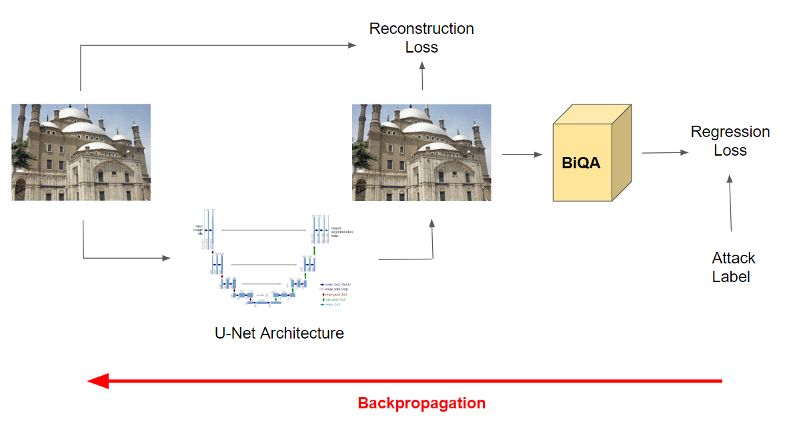

# Pixel Privacy 2020

- Task description: https://multimediaeval.github.io/editions/2020/tasks/pixelprivacy/
- Koniq-10k dataset: http://database.mmsp-kn.de/koniq-10k-database.html

## File Structure:

```
this repo
│   train.py
│   eval.py
│   fgsm.py
│  
└───datasets  
│   │
│   └───koniq
│       │
│       └───pp2020_test
│       │
│       └───pp2020_dev
│       │
│       └───enhance
│           │
│           └───pp2020_test
│           │
│           └───pp2020_dev
```

## Method:



## Dataset:
- Pixel privacy 2020 dataset (Koniq-10k): [link](https://drive.google.com/file/d/1aYyZW4bcGSsRouRuo4HrNg37wFJQp1Bx/view?usp=sharing)
- Enhanced labels (of above dataset): [link](https://drive.google.com/file/d/1BefYNHFxFim5tT_V7dP5Cxo8-eDrZNlU/view?usp=sharing)

## Pretrained weights:
- BIQA checkpoint: [link](https://drive.google.com/file/d/1t8nOxtM4tQhOOQZmYZ1O1ltbywLSAaXe/view?usp=sharing)

## Train full model on enhanced labels:

```
python train.py --path=<path to dataset> --batch_size=<size> --num_epochs=<epochs> --resume=<path to checkpoint>
```

## Inference:
***Using U-Net model***
```
python eval.py --images=<input path to image folder:output path> --pretrained=<path to trained network weight>
```

***Using FGSM***
```
python fgsm.py  --config=<path to yaml config> --images=<input path to image folder:output path> --enhance=<path to enhanced labels>
```

***To enhance image using PIL.ImageEnhance***
```
cd utils
python enhance.py  --images=<input path to image folder:output path>
```

## References:
- SSIM Loss: https://github.com/Po-Hsun-Su/pytorch-ssim
- U Net: https://github.com/bigmb/Unet-Segmentation-Pytorch-Nest-of-Unets
- FGSM: https://savan77.github.io/blog/imagenet_adv_examples.html
